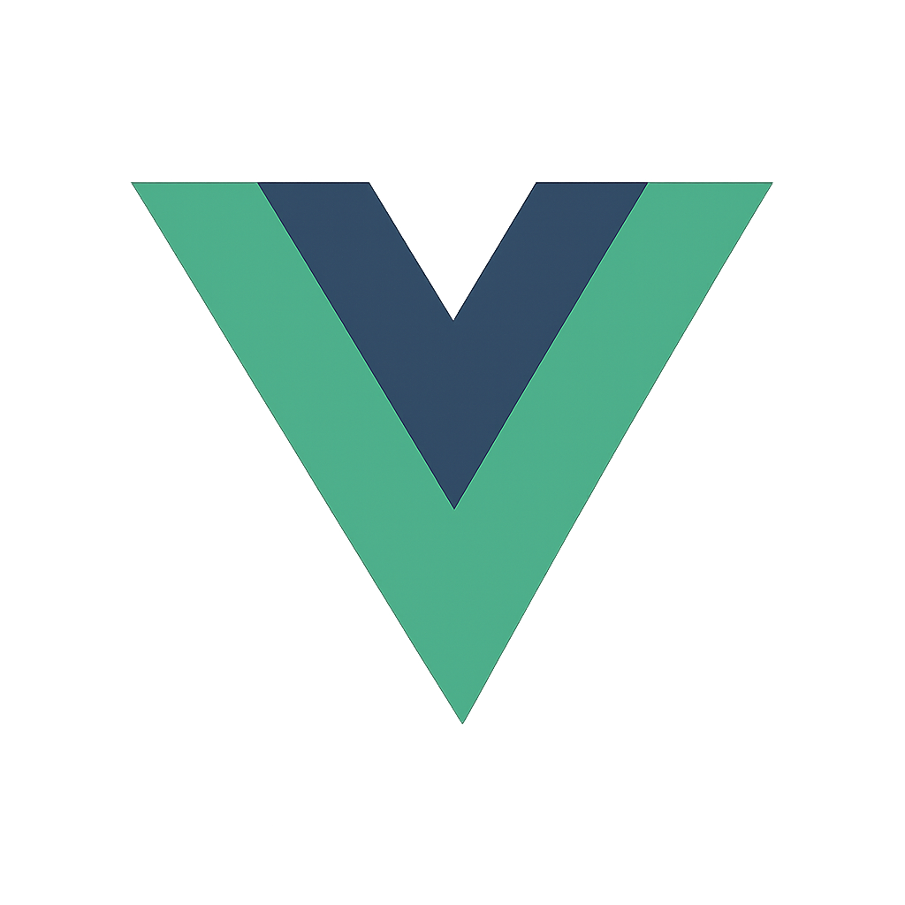

## Olá meu nome é Bruno 👋

Sou Desenvolvedor Front-End na empresa CPV, com experiência em criação de interfaces web modernas, responsivas e performáticas, utilizando principalmente Vue.js, JavaScript, HTML5, CSS3 e SASS.

Atuei em projetos educacionais e institucionais, trabalhando com componentes reutilizáveis, integração com APIs e boas práticas de versionamento com Git/GitHub.

Atualmente curso Ciência da Computação na Universidade UNIP, fortalecendo minha base em algoritmos, estruturas de dados e engenharia de software.

Possuo certificações em Vue.js, UX/UI Design e Desenvolvimento Web Moderno, e estou em constante evolução técnica.

### Linguagens e Ferramentas

	<code></code>&nbsp;&nbsp;
	<code></code>&nbsp;&nbsp;
	<code></code>&nbsp;&nbsp;
	<code></code>&nbsp;&nbsp;
	<code></code>

